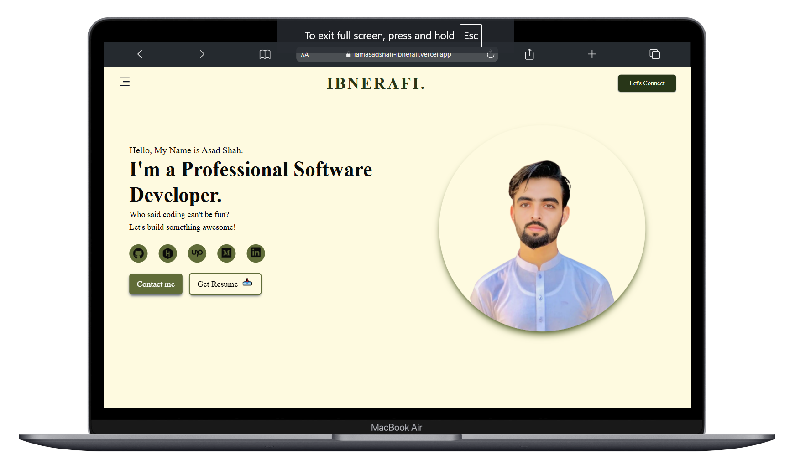
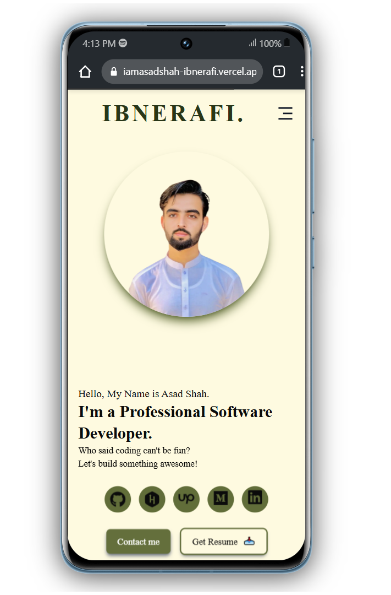

# **My Portfolio Website**

This is a modern, fully responsive portfolio website built with **Next.js**, **TypeScript**, and **Tailwind CSS**. The site showcases my skills, projects, and services in a professional and interactive way. It features dynamic animations, custom cursors, and a seamless navigation experience tailored for both desktop and mobile users.

---

## **Features**

- **Modern Design**: Sleek, minimalistic design with dynamic animations for better engagement.
- **Fully Responsive**: Optimized for all screen sizes, including mobile, tablet, and desktop.
- **Custom Cursor**: Star trail animation follows the cursor for an interactive experience.
- **Mobile-Friendly Navbar**: Mobile navigation menu that auto-hides after clicking.
- **Dynamic Routing**: Smooth page transitions using Next.js' dynamic routing.
- **Reusable Components**: Modularized and reusable components for better scalability.
- **Optimized Performance**: Tailored for fast load times and SEO using Next.js.

---

## **Tech Stack**

- **Frontend**: Next.js, TypeScript, Tailwind CSS
- **Icons**: React Icons
- **Animations**: GSAP (GreenSock Animation Platform)
- **Version Control**: Git and GitHub

---

## **Project Structure**

```plaintext
.
├── components/       # Reusable React components
│   ├── Navbar.tsx    # Responsive Navbar
│   ├── CustomCursor.tsx  # Star-trail animated cursor
├── pages/            # Next.js page routes
│   ├── index.tsx     # Homepage
│   ├── about-me.tsx  # About Me page
│   ├── services.tsx  # Services page
│   ├── projects.tsx  # Projects showcase page
│   ├── contact.tsx   # Contact form page
├── public/           # Static assets (images, icons)
├── styles/           # Global styles or Tailwind configurations
├── README.md         # Documentation for the project
└── package.json      # Project dependencies and scripts

```

## **Setup Instructions**

### **Prerequisites**
- Node.js >= 16.x
- npm or yarn package manager
- Git installed on your machine

### **Installation**

1. Clone the repository:

   ```bash
   git clone https://github.com/iamasadshah/iamasadshah-ibnerafi.git
   cd iamasadshah-ibnerafi

2. Install dependencies:

   ```bash
   npm install
   # or
   yarn install
   ```

3. Start the development server:

   ```bash
   npm run dev
   # or
   yarn dev
   ```

4. Open the app in your browser at [http://localhost:3000](http://localhost:3000).

---

## **Available Scripts**

- **`npm run dev`**: Runs the app in development mode.
- **`npm run build`**: Builds the app for production.
- **`npm run start`**: Starts the production build.

---

## **Future Enhancements**

- Add content management via Sanity or another CMS.
- Improve animations and transitions using advanced GSAP techniques.
- Add unit tests for components using Jest and React Testing Library.
- Deploy the project on platforms like Vercel or Netlify.

---

## **Screenshots**

<div align="center">
  <h3>🌟 Laptop View</h3>
  
  
  <h3>🌟 Mobile View</h3>
  
</div>

---

## **Contributing**

Contributions are welcome! If you have suggestions or issues, feel free to open an issue or create a pull request.

---

## **License**

This project is licensed under the [MIT License](LICENSE).

---

## **Contact**

For any questions or feedback, feel free to reach out:

- LinkedIn: [iamasadshah](https://www.linkedin.com/in/iamasadshah/)
